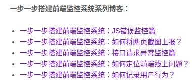

# idea

## 前端监控和埋点

- [前端监控和前端埋点方案设计](https://github.com/forthealllight/blog/issues/23)
- [一步一步搭建前端监控系统：如何记录用户行为？](https://blog.fundebug.com/2019/08/03/how-to-record-user-behavior/)
- [利用Nginx实现用户数据收集](https://kiswo.com/article/1007)

